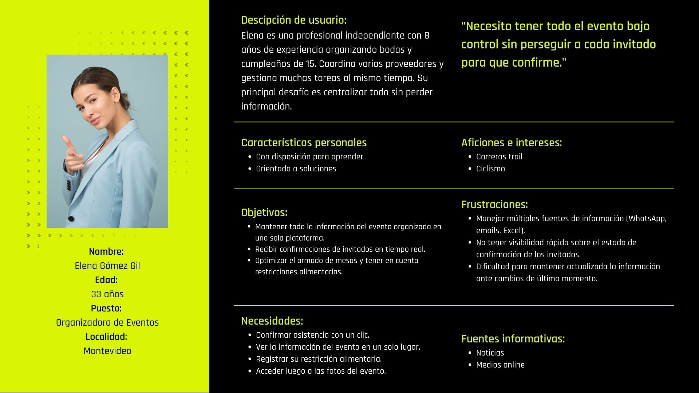
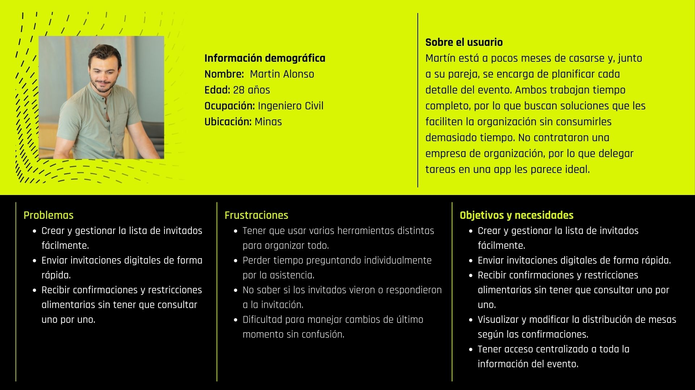
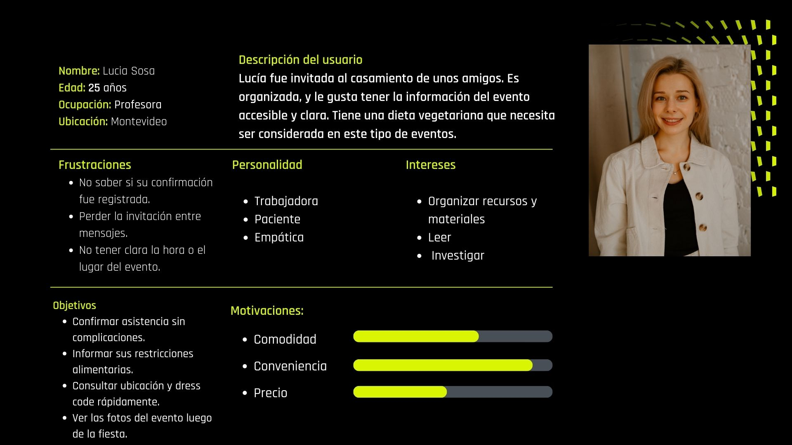
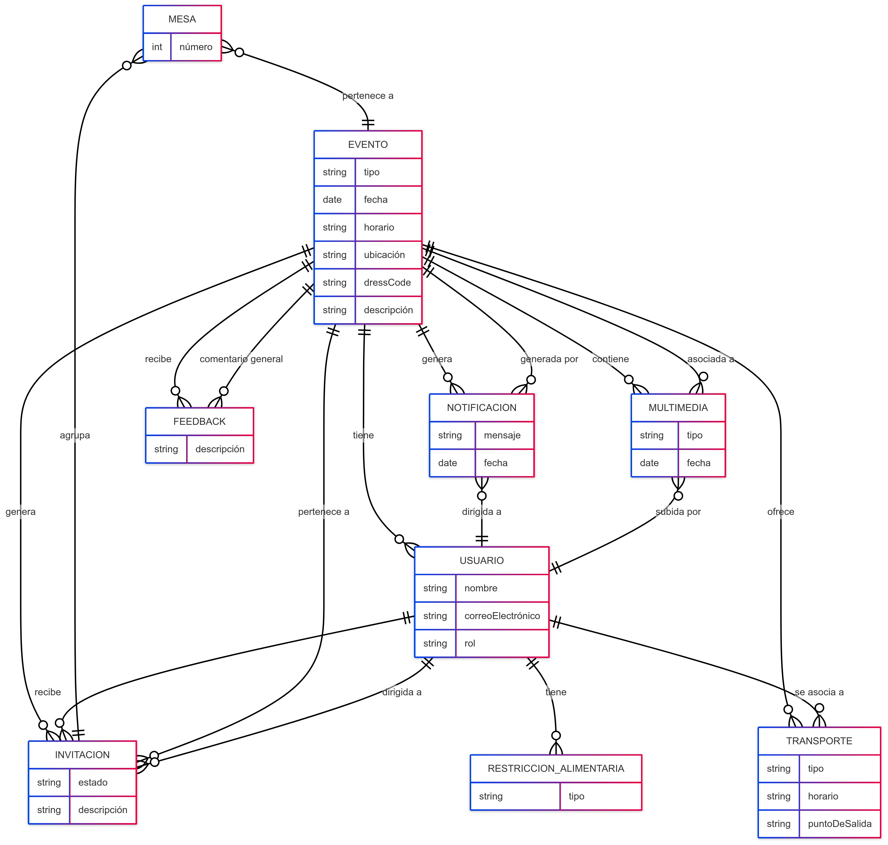

# **Informe 1**

**Problema General:** Entendemos que la organización de bodas y cumpleaños de 15 pueden llegar a tener varios problemas en la comunicación y coordinación entre quien organiza el evento, sus proveedores y los invitados. Pensamos que actualmente las tareas que requieran organizar estos eventos, generalmente, se realizan de forma manual, lo que puede provocar ciertas dificultades en la organización de los mismos.

_Punteo de principales problemas encontrados:_

- Dificultad para enviar las invitaciones a multiples invitados
- Entendimiento eficiente de restricciones alimentarias
- Complejidad para la asignación de mesas
- Confirmación de los invitados
- Comunicación con los proveedores para la gestión del evento (comida, bebida, música, luces, etcétera)

**Usuarios:**

- Organizadores del evento: quien/es se encargan de la organización y coordinación del evento. Que pueden ser los mismos anfitriones, una empresa contratada, familiares cercanos.<!-- haria diferencia entre el anfitrion y el organizador. Patricia el otro dia pregunto que otros usuarios se nos ocurrian ademas de invitado y organizadore, me parece esta bueno sumar ese y alguno mas -->
- Invitados del evento: las personas que asisten al evento que precisan la información clara y concisa, confirmar la asistencia, restricciones en la alimentación (en caso de tener).
- Anfitrión del evento: novios/cumpleañeros, familiares cercanos

**Objetivos principales:**

- Facilitar el envío de las invitaciones.
- Gestionar las confirmaciones de asistencia.
- Gestionar los medios de transporte al evento. <!-- listas de bondi y demas -->
- Centralizar la información del evento (ubicación, horario, dress code).
- Gestionar las restricciones alimentarias puestas por los invitados.
- Gestionar la asignación de las mesas.
- Notifiquar a los usuarios en caso de cambios de último momento.
- Gestion del material audiovisual del evento. <!-- podria ser un link a un dropbox o mismo que queden subidas en la platadforma. Ver con Patricia la idea de la "historia" del evento -->

---

## Repositorio Git.

Se estipularon las siguientes convenciones con el equipo sobre el manejo del repositorio :

1. **Archivos Markdown:**

- Al principio del trabajo, estipulamos que se trabajaria sobre una única branch en el archivo "Informe_1" sobre Main, avisando periódicamente al resto de los integrantes sobre qué estaba trabajando, a modo de evitar parcialmente los conflictos.
- A partir del Lunes 5/5 decidimos que cada integrante del equipo tenga su propia branch sobre la que trabajaría, y se mantuvo la modalidad de aviso a los compañeros a modo de evitar los ya nombrados conflictos.

## Investigación.

En cuanto a la investigación de campo tenemos planeado elicitar de la siguiente manera; hacer entrevistas a personas que se dediquen a organizar este tipo de eventos y también a quién pide la organización (casado/cumpleañero), realizar una serie de cuestionarios, y aplicar ingeniería inversa en plataformas con fines similares. Entraremos en detalle a continuación:

1. **Entrevistas:**

- _Objetivos:_ comprender las necesidades y dificultades que pueden tener los organizadores, así como también los anfitriones del evento con la solicitud de las preferencias tanto de los invitados como de los anfitriones.
- _Aplicación:_ tenemos pensado realizar dos entrevistas a organizadores de este tipo de eventos con experiencia, y también a conocidos que ya se casaron o estan por casarse.

**_Entrevista Nro 1 (anfitrión/organizador):_**

1. ¿Ya tenés una fecha definida para el casamiento? ¿Cuánto tiempo falta?
2. ¿Estás organizando todo por tu cuenta o con ayuda de alguien más (familia,
   wedding planner)?
3. ¿Cuántos invitados planeás tener aproximadamente?
4. ¿Estás usando alguna herramienta (Excel, app, cuaderno, etc.) para organizar el
   evento?
   Sobre invitaciones
5. ¿Cómo pensás enviar las invitaciones? ¿Por mensaje, papel, redes sociales, mail?
6. ¿Te gustaría poder hacer seguimiento de quién confirmó asistencia y quién no?
7. ¿Te interesaría que los invitados puedan responder con un mensaje (saludo,
   aclaración, etc.)?
   Confirmaciones y comunicación
8. ¿Vas a pedir que los invitados confirmen asistencia? ¿Cómo pensás hacerlo?
9. ¿Te parecería útil que la aplicación envíe recordatorios automáticos a los que aún
   no confirmaron?
10. ¿Qué tipo de cambios de último momento creés que podrían surgir? ¿Cómo te
    gustaría comunicarlo?
    Restricciones alimentarias y asignación de mesas
11. ¿Vas a tener en cuenta alergias o preferencias alimentarias? ¿Cómo planeás
    recolectar esa info?
12. ¿Te gustaría que la app te indique automáticamente qué mesas tienen invitados
    con restricciones?
13. ¿Tenés pensado hacer la asignación de mesas manualmente o dejar que alguien
    te ayude?
    Información general del evento
14. ¿Dónde pensás centralizar la información del evento (ubicación, dress code,
    horarios, etc.)?
15. ¿Te parecería útil que los invitados puedan acceder a toda esa info en un solo
    lugar?
    Multimedia y feedback
16. ¿Te gustaría que los invitados compartan fotos o videos del evento en una
    plataforma común?
17. ¿Te interesaría que te den feedback sobre el evento (cómo la pasaron, qué les
    gustó, etc.)?
    Extras
18. ¿Planeás organizar transporte para algunos invitados? ¿Cómo vas a gestionar eso?
19. ¿Hay alguna funcionalidad digital que te gustaría tener y que no mencionamos?
20. ¿Qué parte de la organización te resulta más estresante o difícil hasta ahora?

-_Conclusiones de entrevista:_
La entrevista realizada a esta persona que está organizando su casamiento en pareja por sus propios medios nos permitió validar muchos de los requerimientos que nos habíamos planteado inicialmente en un Brain storm como una idea principal de lo que nos gustaría que tuviera nuestra aplicación para esta clase de eventos, además de descubrir nuevos requerimientos y matices importantes sobre las verdaderas necesidades que necesita el usuario final (anfitrión).

Concluimos inicialmente que la confirmación de asistencia es una parte crucial en la organización en general, principalmente para la asignación de las mesas y restricciones alimentarias que deben ser tratadas con el mayor tiempo posible. También nos plantean que se planean enviar invitaciones de manera digital pero via Whatsapp, algo que podemos solucionar de manera rápida y eficaz en una sección de la aplicación, además de tener la información del evento centralizada en un solo lugar lo destacaron como algo valioso.

Se planteó la idea de que la aplicación enviara recordatorios automáticos para los invitados y tuvimos una respuesta positiva, además de la recopilación de las restricciones alimentarias para que ayudara al salón de eventos a organizarse con las comidas. También la asignación de las mesas prefieron hacerlo de manera manual por ellos mismos, ya que son quienes conocen a los invitados y ver quienes son las personas que puedan sentirse agusto con quienes tienen al rededor, pero tener ayuda tecnológica seria genial.

Una de las funcionalidades que le planteamos y generó gran entusiasmo fue la posiblidad de compartir fotos del evento en un solo espacio accesible para todos los invitados (incluyendo anfitriones) del evento, lo que nos llevó a reconsiderar la priorización de este requerimiento. Además, mostraron interés por una sección donde los invitados puedan dar su feedback del evento, pero sin darle tanta prioridad como la sección de imágenes.

Finalmente nos comenta que la creación de la lista de invitados es una de las tareas mas complejas a la hora de organizar el evento, por lo que decidimos darle una alta prioridad para facilitar la gestion.

Gracias a la entrevista, se realizaron los siguientes cambios en la priorización de los requerimientos funcionales:

| Código | Prioridad anterior | Prioridad nueva | Justificación                                                                 |
| ------ | ------------------ | --------------- | ----------------------------------------------------------------------------- |
| RF01   | Must               | Must            | Confirmado como esencial en la entrevista.                                    |
| RF02   | Must               | Must            | Se reafirma la importancia de recibir respuesta de los invitados.             |
| RF03   | Should             | Must            | El entrevistado destacó que los recordatorios serían de “mucha utilidad”.     |
| RF04   | Must               | Must            | Validado: se hará de forma manual, pero requiere soporte digital.             |
| RF05   | Should             | Should          | Útil, pero sigue siendo un valor agregado, no imprescindible.                 |
| RF06   | Must               | Must            | Confirmado: se gestionan desde la confirmación de asistencia.                 |
| RF07   | Must               | Should          | Se mencionó que cambios de último momento no son esperados; baja su urgencia. |
| RF08   | Should             | Should          | No fue mencionado directamente, pero sigue siendo útil.                       |
| RF09   | Could              | Won’t           | Confirmaron que no gestionarán transporte.                                    |
| RF10   | Must               | Must            | Considerado útil por la pareja entrevistada.                                  |
| RF11   | Must               | Must            | Necesario para actualizar información del evento si es necesario.             |
| RF12   | Could              | Should          | Mencionado como “estaría buenísimo”; aumenta su prioridad.                    |
| RF13   | Must               | Must            | Necesario para gestionar los distintos tipos de usuarios.                     |
| RF14   | Could              | Could           | Interés moderado; se mantiene como funcionalidad opcional.                    |

Además, de darnos cuenta de que no habíamos creado un requerimiento para gestionar la lista de invitados, por lo que se agrega el RF00 – Gestión de lista de invitados.

[Entrevista 1](img/entrevista1.jpg)  
[Entrevista 2](ENTREVISTA%ORGANIZADORA.m4a)

2. **Encuestas:**

- _Objetivos:_ obtener datos cuantitativos sobre las necesidades y preferencias de los usuarios a la hora de concurrir a estos eventos.
- _Aplicación:_ la idea es distribuir un cuestionario de manera online para todo aquel que haya concurrido a algún evento para recabar información sobre su experiencia.

-_Cuestionario para Organizador:_

- ¿Qué herramientas utilizás actualmente para organizar un evento (apps, planillas, papel, otras)?

- ¿Cuáles son las principales dificultades que enfrentás durante la planificación de un evento?

- ¿Cómo gestionás las confirmaciones de los invitados y los cambios de último momento?

- ¿Tenés en cuenta restricciones alimentarias? ¿Cómo las recopilás y compartís con los proveedores?

- ¿Solés usar alguna herramienta para la asignación de mesas? ¿Cómo decidís quién se sienta con quién?

- ¿Qué tipo de comunicación mantenés con los invitados y anfitriones durante el proceso?

- ¿Cómo hacés para mantener toda la información organizada y accesible durante el evento?

- ¿Qué funcionalidades te gustaría que tenga una app ideal para ayudarte a organizar eventos?

- ¿Cómo gestionás el presupuesto con los clientes? ¿Usás alguna app para ello?

- ¿Te interesaría tener una herramienta que integre todo en un solo lugar? ¿Qué condiciones debería cumplir para que la uses?

-_Cuestionario para Usuario Final (persona que organizó su boda o cumpleaños de 15):_

-     ¿Cómo organizaste tu evento (boda/cumpleaños)? ¿Lo hiciste vos, alguien cercano o contrataste a alguien?

- ¿Qué herramientas usaste para gestionar la organización? (listas, apps, mails, Excel, etc.)

- ¿Cómo fue el proceso de enviar las invitaciones y recibir confirmaciones? ¿Qué fue lo más difícil?

- ¿Tuviste que tener en cuenta restricciones alimentarias? ¿Cómo lo gestionaste?

- ¿Cómo resolviste el tema de la distribución de mesas o lugares para los invitados?

- ¿Te resultó fácil mantener informados a tus invitados sobre horarios, dirección, dress code, etc.?

- ¿Hubo cambios de último momento? ¿Cómo se los comunicaste a los invitados?

- ¿Te hubiera resultado útil una app que centralizara todo esto? ¿Qué funcionalidades te gustaría que tuviera?

- ¿Qué parte de la organización te generó más estrés o complicaciones?

- ¿Te gustaría haber tenido un espacio digital para compartir fotos, recuerdos o mensajes del evento?

-_Conclusiones de cuestionarios:_

3. **Análisis de GUI (ingeniería inversa):**

- _Objetivos:_ El objetivo del analisis de ingenieria inversa, es inspirarse de otras aplicaciones asi como contrastar funcionalidades y decisiones de diseño que se tomaron.
- _Aplicación:_ En nuesto caso, seleccionamos 3 aplicaciones; Casamiento.com.uy, MyWed y Bridebook. Inicialmente, revisamos foros y documentaciones así como blogs de reseñas de varias aplicaciones para entender y contrastar con el brainstorming inicial y seleccionar que aplicaciones ibamos a realizar el proceso de GUI. Inicialmente se buscó entender que cómo se registran los usuarios, como se realizan las diferentes solicitudes de invitación, confirmaciones de asistencia y restricciones, así como el envio de notificaciones y modificaciones de último momento.

-_Resumen de apps:_ Las 3 aplicaciones, funcionan tanto en ambiente web, como en Andriod y IOS. En el caso de Casamiento.com,uy, es una versión segmentada a la población uruguaya, mantiene las mismas funciones que Bodas.Net (son del mismo desarrollador). Sin embargo, esta ajustado el idioma de la app, para el usuario final uruguayo. Donde se utilizan terminos locales que no generan ambiguedad. Tanto casamiento.com.uy como Bodas.NET permite organizar las tareas presupuesto e invitados. Tener una web personalizada de tu casamiento, poder acceder a foros sobre discusiones y buenas practicas de cara a la organización así como acceder a un directorio de de proovedores.

Mywed: Permite listar tareas, realizar y asignar presupuesto así como la gestión de invitados. Posee una interfaz simple y sencilla que facilita la gestión a un usuario final que no es un organizador profesional. No permite la asignación de mesas o control de invitados por mesa, como si Bridebook o Bodas.Net.

Bridebook. Es la app más completa, permite gestionar todos los aspectos del evento ya mencionados (tareas, presupuesto, invitados) yendo un paso más alla en algunas de sus funciones, como la posibilidad de agendar una tarea. Como punto alto, y donde se destaca es que en las funciones que tienen Bodas.Net y MyWed, Bridebook permite gestionar en un ambiente colaborativo, lo que permite visualizar la organización y gestionar, tanto a la pareja, como un organizador profesional u otros colaboradores del evento.

\_Identificación de apps:\_Se seleccionaron las aplicaciones luego de hacer un relevamiento, de aplicaciones que permiten gestionar u organizar eventos. Se busco, tener aplicaciones de diferentes funcionalidades para enriquecer la comparativa. Siendo MyWed, una app más sencilla y casamiento.com.uy y bridebook, más completas en cuanto a la gestión y funcionalidades incorporadas por la app. Se eligio casamiento.com.uy ya que era direccionada al mercado uruguayo, y Bridebook, una de las más usadas y referenciada.

Comparativa de RF:

| Código | MyWed     | Bridebook | Casamiento.com.uy |
| ------ | --------- | --------- | ----------------- |
| RF00   | Cumple    | Cumple    | Cumple            |
| RF01   | Cumple    | Cumple    | Cumple            |
| RF02   | Cumple    | Cumple    | Cumple            |
| RF03   | No cumple | Cumple    | Cumple            |
| RF04   | No cumple | Cumple    | Cumple            |
| RF05   | No cumple | Cumple    | Cumple            |
| RF06   | No cumple | Cumple    | Cumple            |
| RF07   | No cumple | Cumple    | Cumple            |
| RF08   | No cumple | Cumple    | Cumple            |
| RF09   | No cumple | No Cumple | No Cumple         |
| RF10   | Cumple    | Cumple    | Cumple            |
| RF11   | Cumple    | Cumple    | Cumple            |
| RF12   | No cumple | No Cumple | Cumple            |
| RF13   | Cumple    | Cumple    | Cumple            |
| RF14   | No cumple | No Cumple | Cumple            |

Comparativa de RNF:

| Código | MyWed     | Bridebook | Casamiento.com.uy |
| ------ | --------- | --------- | ----------------- |
| RNF01  | Cumple    | Cumple    | Cumple            |
| RNF02  | No cumple | Cumple    | Cumple            |
| RNF03  | Cumple    | Cumple    | Cumple            |
| RNF04  | No cumple | Cumple    | Cumple            |
| RNF05  | Cumple    | Cumple    | Cumple            |
| RNF06  | Cumple    | Cumple    | Cumple            |

4. **User Persona:**

- _Objetivos:_ crear perfiles ideales y representativos de los usuarios para entender sus necesidades y definir funcionalidades.
- _Aplicación:_ luego de realizadas las entrevistas y encuestas, podremos crear perfiles ficticios para cada tipo de los usuarios definidos.

_User Persona Organizador_

_User Persona Anfitrión_

_User Persona Invitado_

La elaboración de los User Personas permitió entender con mayor profundidad los distintos perfiles que interactuarán con el sistema: organizadores de eventos, anfitriones e invitados. A través de la combinación de entrevistas reales, análisis del dominio e ingeniería inversa, logramos construir representaciones realistas que reflejan necesidades, objetivos, frustraciones y comportamientos concretos.

- Alinear los requerimientos funcionales con las verdaderas expectativas de los usuarios.
- Detectar funcionalidades clave que podrían pasar desapercibidas (como el registro de restricciones alimentarias o el espacio multimedia).
- Identificar diferencias claras entre los roles, evitando soluciones “genéricas” que no se adaptan a ningún perfil en particular.
- Anticipar problemas de experiencia de usuario, como la sobrecarga de herramientas o la falta de confirmaciones.

En conclusión, los User Personas no solo nos ayudaron a visualizar a quién está dirigido el sistema, sino que también nos ayudó a encontrar soluciones para diferentes problemas que podría tener la aplicación.

## Requerimientos

### Funcionales

RF00 – Gestión de lista de invitados  
El sistema debe permitir a los organizadores y anfitriones crear, editar y eliminar la lista de invitados asociada a un evento. Esto se puede realizar de manera manual ingresando nombre, apellido, email y teléfono o cargar un Excel con dicha información.

RF01 – Envío de invitaciones  
El sistema debe permitir a los organizadores y anfitriones enviar invitaciones digitales a los invitados.

RF02 – Confirmación de asistencia con mensaje  
El sistema debe permitir a los invitados aceptar o rechazar la invitación, con la opción de adjuntar un mensaje personalizado.

RF03 – Envío de recordatorios  
El sistema debe enviar recordatorios automáticos a los invitados que aún no hayan confirmado su asistencia.

RF04 – Asignación y gestión de mesas  
El sistema debe permitir a los organizadores y anfitriones asignar y gestionar la ubicación de los invitados en las mesas del evento.

RF05 – Alertas por restricciones alimentarias  
El sistema debe alertar a los organizadores sobre mesas que incluyan invitados con restricciones alimentarias.

RF06 – Registro de restricciones alimentarias  
El sistema debe permitir a los invitados registrar sus restricciones alimentarias y a los organizadores visualizarlas.

RF07 – Notificaciones por cambios de último momento  
El sistema debe permitir enviar notificaciones a los usuarios en caso de cambios relevantes de último momento en el evento.

RF08 – Notificaciones personalizadas  
El sistema debe permitir a los organizadores enviar notificaciones personalizadas a uno o más invitados.

RF09 – Gestión de transporte  
El sistema debe permitir a los invitados indicar si requieren transporte y mostrar esta información a los organizadores para su planificación.

RF10 – Sección de información general del evento  
El sistema debe ofrecer una sección donde todos los usuarios puedan acceder a información clave del evento (ubicación, horario, dress code, etc.).

RF11 – Actualización de información del evento  
El sistema debe permitir a los organizadores actualizar en tiempo real la información general del evento disponible para los invitados.

RF12 – Espacio multimedia compartido  
El sistema debe permitir a organizadores e invitados compartir fotos y videos del evento en un espacio común.

RF13 – Gestión de roles de usuario  
El sistema debe permitir definir y gestionar diferentes roles de usuario: organizadores, anfitriones e invitados.

RF14 – Feedback del evento  
El sistema debe permitir a los invitados dejar comentarios sobre el evento, accesibles únicamente para organizadores y anfitriones.

**Priorización MoSCoW**
| Código | Prioridad |
|--------|-----------|
| RF00 | Must |
| RF01 | Must |
| RF02 | Must |
| RF03 | Must |
| RF04 | Must |
| RF05 | Should |
| RF06 | Must |
| RF07 | Should |
| RF08 | Should |
| RF09 | Won’t |
| RF10 | Must |
| RF11 | Must |
| RF12 | Should |
| RF13 | Must |
| RF14 | Could |

### No funcionales

RNF01 – Interfaz amigable y responsiva  
La aplicación debe tener una interfaz intuitiva y fácil de usar, accesible desde dispositivos móviles, tablets y computadoras de escritorio.

RNF02 – Tiempo de respuesta de notificaciones  
El sistema debe ser capaz de enviar notificaciones automáticas en un tiempo menor a 1 minuto luego de que se detecte una modificación relevante en el evento.

RNF03 – Privacidad y protección de datos  
La aplicación debe garantizar la privacidad de la información personal de los invitados y de los datos del evento, cumpliendo con buenas prácticas de seguridad.

RNF04 – Escalabilidad  
El sistema debe soportar al menos 500 invitados por evento sin experimentar degradación en el rendimiento o tiempos de respuesta.

RNF05 – Soporte multilenguaje  
El sistema debe estar disponible en español e inglés, y permitir extenderse a otros idiomas en el futuro.

RNF06 – Cumplimiento con normativas de publicación  
La aplicación debe cumplir con las políticas de publicación y revisión de las principales tiendas:

- [Apple App Store Review Guidelines](https://developer.apple.com/app-store/review/guidelines/)
- [Google Play Developer Policies](https://support.google.com/googleplay/android-developer/answer/113469#policy)

RNF07 – Tiempo de respuesta del sistema  
La aplicación debe responder a las acciones del usuario (clics, navegación, envío de formularios) en menos de 4 segundos en condiciones normales de uso.

RNF08 – Mantenibilidad del sistema  
El sistema debe estar diseñado de manera modular para facilitar la incorporación de nuevas funcionalidades o modificaciones sin afectar el rendimiento general.

| Código | Prioridad |
| ------ | --------- |
| RNF01  | Must      |
| RNF02  | Should    |
| RNF03  | Must      |
| RNF04  | Should    |
| RNF05  | Could     |
| RNF06  | Must      |
| RNF07  | Should    |
| RNF08  | Should    |

---

## Historias de usuario y Casos de uso.

### Historias de usuario:

HU01 – Envío de invitaciones
**Como** anfitrión
**quiero** poder enviar invitaciones digitales a todos los invitados desde la aplicación
**para** asegurarme de que reciban la información completa del evento y puedan confirmar su asistencia a tiempo.
**Criterios de aceptación:**

1. El organizador o anfitrión puede crear o cargar una lista de invitados con nombre, correo electrónico y número de contacto.
2. El sistema permite seleccionar una plantilla de invitación o crear una personalizada.
3. Las invitaciones se envían por correo electrónico o notificación push, dependiendo de la preferencia configurada por el usuario.
4. El sistema registra el estado de cada invitación como: pendiente, aceptada o rechazada, y muestra esta información al organizador.
5. El sistema debe enviar todas las invitaciones en un plazo máximo de 5 minutos desde su confirmación de envío.

HU02 – Confirmar asistencia como invitado 
**Como** invitado 
**quiero** poder confirmar o rechazar la invitación desde la aplicación 
**para** que el organizador tenga información sobre mi asistencia al evento. 
**Criterios de aceptación:**

1. El invitado puede acceder a la invitación desde un enlace recibido por correo o notificación.
2. El sistema muestra opciones claras de "Aceptar" o "Rechazar", y permite adjuntar un mensaje opcional de hasta 100 caracteres.
3. El sistema confirma la recepción de la respuesta mediante un mensaje automático.
4. El organizador puede visualizar el estado actualizado de la asistencia del invitado en tiempo real.
5. El invitado puede modificar su respuesta hasta 7 días antes del evento.

HU03 – Enviar recordatorios. 
**Como** organizador 
**quiero** poder enviar recordatorios automáticos a los invitados que aún no hayan confirmado asistencia 
**para** asegurar una planificación precisa del evento y evitar imprevistos. 
**Criterios de aceptación:**

1. El sistema identifica de manera automática los invitados que no confirmaron asistencia aún.
2. El organizador puede programar los recordatorios para que se envíen en fechas específicas.
3. El sistema debe enviar el recordatorio por correo o notificación push.
4. El organizador recibe una confirmación del envío y puede ver si el invitado abrió el mensaje.

### Casos de uso:

CU01: Enviar invitaciones 
**Descripción:**  
El organizador del evento quiere enviar invitaciones a los invitados a través de la plataforma, para asegurar que todos los invitados reciban la información del evento.

**Actores:**  
Organizador, Invitado <!-- a raiz de esto, saque a los anfitriones de los que podian invitar en la RF01. Para mi estaria buenos dejarlo, o ver si se puede tener evento sin organizador pero con anfitrion, o viceversa-->

**Precondiciones:**

- El organizador debe haber iniciado sesión en la plataforma.
- El evento debe estar creado y configurado con información básica (fecha, hora, lugar).
- Debe existir una lista de invitados cargada o la posibilidad de ingresar nuevos. <!-- ingresar nuevos no seria lo que queremos en este caso de uso?-->

**Postcondiciones:**

- Las invitaciones son enviadas exitosamente por los medios seleccionados (correo electrónico, mensaje, etc.).
- Se registra el estado de cada invitación (como pendiente, inicialmente).

**Flujo Normal**
| # | Acción (actor) | Reacción (sistema) |
|---|----------------|--------------------|
| 1 | El organizador accede a la sección de envío de invitaciones | Muestra la interfaz de envío de invitaciones |
| 2 | Selecciona invitados desde una lista o los ingresa manualmente | Carga los datos de los invitados y muestra las opciones de medios de envio (email, mensaje, etc.)|
| 3 | Elige el medio de envío | Solicita confirmación mostrando los nuevos invitados|
| 4 | Confirma el envío de invitaciones | El sistema envía las invitaciones y muestra una notificación de éxito |

**Flujos alternativos**

| #   | Acción (actor)                                | Reacción (sistema)                                                   |
| --- | --------------------------------------------- | -------------------------------------------------------------------- |
| 2.1 | Si el organizador no tiene invitados cargados | El sistema le solicitará agregar al menos un invitado para continuar |
| 4.1 | Si ocurre un error durante el envío           | El sistema notifica el error y sugiere reintentar más tarde          |

 
_El bosquejo de la aplicacion fue creado en Paint_

CU02: Aceptar invitacion 
**Descripción:**  
Un invitado del evento quiere aceptar la invitacion a través de la plataforma.
**Actores:**  
Invitado

**Precondiciones:**

- El invitado debe haber recibido una invitación al evento que quiere aceptar.
- El evento debe estar creado y configurado con información básica (fecha, hora, lugar).
- El invitado debe haber iniciado sesión en la aplicación

**Postcondiciones:**

- Se registra el estado de la invitación como confirmada.
- Se registran las restricciones alimentarias si corresponden.
- Se registra si el invitado hara uso del medio de transporte si corresponde.

**Flujo Normal**
| # | Acción (actor) | Reacción (sistema) |
|---|----------------|--------------------|
| 1 | El invitado accede a la sección de invitaciones | La interfaz muestra las invitaciones correspondientes al usuario |
| 2 | Sobre la invitacion que desea aceptar clickea el boton de "aceptar invitacion" | El sistema pide confirmacion|
| 3 | El invitado confirma | El sistema despliega un cuadro preguntando si hara uso del transporte |
| 4 | Elige si hará uso del transporte del evento | El sistema muestra una notificación de éxito |

**Flujos alternativos**

| #   | Acción (actor)                             | Reacción (sistema)                                          |
| --- | ------------------------------------------ | ----------------------------------------------------------- |
| 3.1 | Si ocurre un error durante la confirmación | El sistema notifica el error y sugiere reintentar más tarde |

 
_El bosquejo de la aplicacion fue creado en Paint_

CU03: Rechazar invitacion 
**Descripción:**  
Un invitado del evento quiere rechazar la invitacion a través de la plataforma.
**Actores:**  
Invitado

**Precondiciones:**

- El invitado debe haber recibido una invitación al evento que quiere rechazar.
- El evento debe estar creado y configurado con información básica (fecha, hora, lugar).
- El invitado debe haber iniciado sesión en la aplicación

**Postcondiciones:**

- Se registra el estado de la invitación como rechazada.

**Flujo Normal**
| # | Acción (actor) | Reacción (sistema) |
|---|----------------|--------------------|
| 1 | El invitado accede a la sección de invitaciones | La interfaz muestra las invitaciones correspondientes al usuario |
| 2 | Sobre la invitacion que desea aceptar clickea el boton de "rechazar invitacion" | El sistema pide confirmacion |
| 3 | El invitado confirma | El sistema muestra una notificación de éxito |

**Flujos alternativos**

| #   | Acción (actor)                        | Reacción (sistema)                                          |
| --- | ------------------------------------- | ----------------------------------------------------------- |
| 2.1 | Si ocurre un error durante el rachazo | El sistema notifica el error y sugiere reintentar más tarde |

---

 
_El bosquejo de la aplicacion fue creado en Paint_

## Modelo de Dominio.

El modelo de dominio representa los conceptos clave del sistema y sus relaciones, brindando una visión conceptual del funcionamiento del negocio. En este caso, el dominio gira en torno a la organización de eventos sociales como bodas y cumpleaños de 15, con foco en la interacción entre organizadores, anfitriones e invitados.

Se definió el modelo a través de un **Modelo Entidad-Relación (MER)**, que incluye las entidades principales del sistema, atributos relevantes y relaciones entre ellas.

### Entidades y atributos

- **Evento**  
  `tipo`, `fecha`, `horario`, `ubicación`, `dress code`, `descripción`

- **Usuario**  
  `nombre`, `correo electrónico`, `rol` (organizador, anfitrión, invitado)

- **Invitación**  
  `estado (pendiente, aceptada, rechazada)`, `descripción`

- **Mesa**  
  `número`

- **Restricción Alimentaria**  
  `tipo (celíaco, vegano, vegetariano, etc.)`

- **Transporte**  
  `tipo (ómnibus, auto, camioneta)`, `horario`, `punto de salida`

- **Notificación**  
  `mensaje`, `fecha`

- **Multimedia**  
  `tipo (imagen, video)`, `fecha`

- **Feedback**  
  `descripción`, `usuario`

---

### Relaciones

- Un **evento** tiene muchos **usuarios** (organizador, anfitrión e invitados).
- Un **evento** genera muchas **invitaciones**, cada una dirigida a un **usuario**.
- Una **mesa** pertenece a un único **evento** y agrupa **invitaciones aceptadas**.
- Un **usuario** puede tener una **restricción alimentaria**.
- Un **evento** genera muchas **notificaciones**, cada una dirigida a uno o más **usuarios**.
- Un **evento** puede tener varios **contenidos multimedia**.
- Un **evento** puede recibir múltiples **feedbacks** de los usuarios.
- Un **evento** puede ofrecer uno o más **transportes**, que asocian a varios **usuarios**.

---

### Diagrama MER

_El diagrama fue generado con un prompt colocado en la herramienta [Mermaid](https://mermaid.js.org/)._

## Verifiación y Validación.

### Verificación de Requerimientos

Con el fin de verificar los requerimientos funcionales y no funcionales definidos en este informe anteriormente, se aplicaron las siguientes técnicas:

#### 1. Revisiones (Peer Reviews)

Se realizaron revisiones dentro del equipo de manera informal, donde cada miembro leyó y analizó la especificación de requerimientos, enfocándose en identificar ambigüedades, inconsistencias y omisiones. Estas revisiones permitieron detectar mejoras en la redacción y redefinir requerimientos.

#### 2. Listas de Verificación (Checklists)

Se utilizó una lista basada en criterios de calidad para evaluar cada requerimiento:

- **Completitud:** Se verificó que todos los tipos de usuarios y funcionalidades identificadas durante la fase de investigación estuvieran representados.
- **Verificabilidad y no ambigüedad:** Se procuró que todos los requerimientos fueran específicos, implementados con lenguaje claro.
- **Correctitud y consistencia:** Se buscó que no se generaran inconsistencias entre los requerimientos.
- **Trazabilidad:** Se vinculó cada requerimiento a su origen, principalmente brain storming, entrevistas, e ingenieri inversa de plataformas similares.

#### 3. Análisis de Trazabilidad

Se construyó un registro de trazabilidad informal que relaciona requerimientos con entrevistas y conclusiones, facilitando el seguimiento de su origen y su impacto en otras partes del sistema.

---

### Validación de Requerimientos

Inicialmente se realizó un brain storming en el que se estipularon algunas funcionalidades básicas entre los miembros del equipo. Estas funcionalidades expresadas en lo requeriminetos luego fueron verificadas con las siguietnes técnicas:

#### 1. Entrevistas y Cuestionarios

Se validaron los requerimientos mediante entrevistas a usuarios reales (anfitriones y organizadores) y cuestionarios diseñados para recolectar experiencias reales. Gracias a esto, se ajustaron prioridades y se agregaron nuevos requerimientos (como RF00 – Gestión de lista de invitados).

#### 2. Análisis de Casos de Uso

Los casos de uso fueron validados a través del razonamiento con los perfiles de usuario generados (User Personas), asegurando que reflejan tareas reales y necesidades del sistema. Se confirmó que las interacciones definidas cubren las ya mencionadas funcionalidades básicas.

#### 3. Prototipado

Si bien aún no se desarrolló un prototipo funcional, se crearon bosquejos visuales de los flujos más importantes (en Paint) que sirvieron como apoyo para validar la comprensión del sistema con usuarios no técnicos.

---

### Conclusiones de Verificación y Validación

- **Los requerimientos funcionales definidos son completos y trazables respecto a las fuentes identificadas.**
- **La especificación fue validada con usuarios reales mediante entrevistas, lo que permitió refinar y priorizar funcionalidades clave.**
- **Las funcionalidades con mayor valor fueron priorizadas como Must en el modelo MoSCoW.**
- **Las listas de verificación permitieron garantizar la claridad y consistencia de los requerimientos documentados.**

## Descripción del trabajo individual.

A continuación se detalla el trabajo realizado por cada integrante del equipo, incluyendo fechas, tipo de actividad, participantes involucrados y horas aproximadas dedicadas.

| Fecha      | Actividad                                                                                                                                                  | Participantes | Horas dedicadas por integrante |
| ---------- | ---------------------------------------------------------------------------------------------------------------------------------------------------------- | ------------- | ------------------------------ |
| 01/05/2025 | Se agrega información inicial en el Informe 1                                                                                                              | Todos         | 2 h cada uno                   |
| 01/05/2025 | Definición inicial de requerimientos no funcionales                                                                                                        | Ignacio       | 30 min                         |
| 01/05/2025 | Definición inicial de requerimientos funcionales                                                                                                           | Nikolas       | 45 min                         |
| 01/05/2025 | Redacción de requerimientos funcionales y diferentes cambios                                                                                               | Todos         | 2 h cada uno                   |
| 01/05/2025 | Relevamiento de datos aplicaciones a utilizar en GUI. Lectura de blogs de organización de eventos y foros                                                  | Cristian      | 2 hs                           |
| 01/05/2025 | Cuestionario para organizador y usuario final                                                                                                              | Cristian      | 1 hs                           |
| 02/05/2025 | Corrección en los Requerimientos Funcionales y se agrega priorización MosCow                                                                               | Ignacio       | 2 h                            |
| 04/05/2025 | Se agregó un modelo de dominio inicial                                                                                                                     | Ignacio       | 2 h                            |
| 04/05/2025 | Se agregó una HU y un CU                                                                                                                                   | Ignacio       | 1 h                            |
| 04/05/2025 | Retoques en priorizacion MoSCow, en caso de uso enviar invitaciones, y en redacción del informe                                                            | Nikolas       | 2 h                            |
| 10/05/2025 | Entrevista                                                                                                                                                 | Ignacio       | 1 h                            |
| 10/05/2025 | Analisis GUI MyWed, Casamiento.com.uy y Bridebook                                                                                                          | Cristian      | 10 hs                          |
| 15/05/2025 | Se agrega la entrevista y conclusiones de la misma, modificación en las priorizaciones y RFs. También se modifican los RNF y cambio en las priorizaciones. | Ignacio       | 3 h                            |
| 16/05/2025 | Creación de Users Persona y conclusiones de los mismos                                                                                                     | Ignacio       | 2 h                            |
| 17/05/2025 | Creación de tres historias de usuario y se mejora el modelo de dominio.                                                                                    | Ignacio       | 2 h                            |
| 17/05/2025 | Entrevista con Organizadora                                                                                                                                | Nikolas       | 1 h                            |
| 17/05/2025 | Se agregan 2 casos de uso                                                                                                                                  | Nikolas       | 2 h                            |
| 17/05/2025 | Mapeo de reflexión inicial                                                                                                                                 | Cristian      | 1 h                            |
| 18/05/2025 | Se agregan las implementaciones gráficas de los casos de uso                                                                                               | Nikolas       | 2 h                            |
| 19/05/2025 | Se agregan reflexión                                                                                                                                       | Todos         | 30 min                         |
| 19/05/2025 | Cambios en redacción                                                                                                                                       | Nikolas       | 1 h                            |

---

## Reflexión.

Durante el desarrollo del proyecto, pudimos aplicar en el obligatorio muchos de los contenidos y conceptos que fuimos viendo a lo largo del curso. Nos permitió entender y poner en práctica el como definir un problema, como identificar usuarios, elicitación de requerimientos así como el poner en uso práctico los conocimientos de GIT y formato Markdown a la hora de realizar la entrega.

Inicialmente fue complejo identificar una buena práctica para el uso de GIT y definir la estrategia. Dudamos sobre si era preferible designar ramas por bloque o desarrollador, siendo la ultima la opción que terminamos empleando debido a que generábamos un mejor control de versionado.

A la hora de hacer los requerimientos, comenzamos utilizando el metodo de brainstorming, para luego hacer las entrevistas/encuestas y el proceso de GUI. Si bien nos resultó útil el haber realizado el brainstorming inicialmente, pudimos haber estado condicionados al momento de hacer las entrevistas ya que teniamos una perspectiva general ya ideada. Este punto, entendemos que es un aprendizaje.

Otro punto a destacar fue que no llevamos un conteo minucioso de las horas que trabajó cada uno en cada bloque, lo cual generó una complicación al momento de describir el trabajo individual de los integrantes. A futuro, tomaremos esto en cuenta a modo de que la descripción del trabajo de cada compañero sea lo más fiel posible.

Otra reflexión es el trabajo que lleva implementar gráficamente el sistema. Fue tedioso bosquejar en Paint, lo que nos lleva a pensar que encima de ello hacerlo con código y que los botones realicen verdaderamente acciones es un trabajo más que complejo.
