# **Informe 2**

## Selección de Funcionalidad

Nos planteamos como objetivo cumplir con los siguientes requisitos funcionales que le dimos como prioridad MUST, ya que nos parecían cosas básicas a implementar para que una aplicación de este índole funcione correctamente y de la mejor manera.

- **Inicio de sesión**  
    Tenemos en cuenta desde el primer checkpoint que no era necesario validar un inicio de sesión, pero nos parecio la manera mas sencilla y accesible de diferenciar las diferentes secciones según el rol de los usuarios creados.

    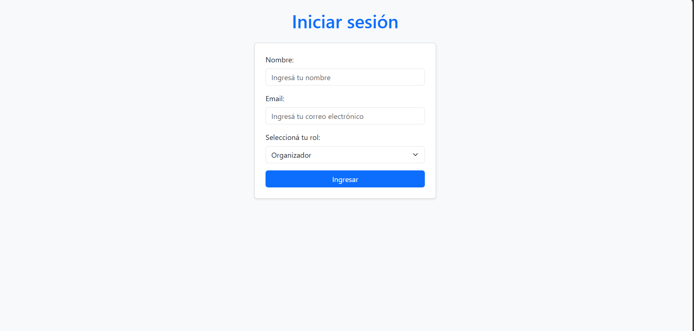

    En el momento de colocar Nombre y Email se crea el usuario automáticamente según el rol que se haya seleccionado en el select, y a continuación, te mostrará las secciones correspondientes a cada rol.

    Nos pareció una idea interesante ya que desde un principio manejamos las secciones a mostrar y según el rol elegido, la página se ve de diferente manera.

- **RF00 – Gestión de lista de invitados**  
    _"El sistema debe permitir a los organizadores y anfitriones     crear, editar y eliminar la lista de invitados asociada a un    evento. Esto se puede realizar de manera manual ingresando     nombre, apellido, email y teléfono o cargar un Excel con dicha      información."_

    Para este RF realizamos la sección de "Invitados" donde se permite crear invitados con los datos mencionados en el requisito funcional y realizando las validaciones correspondientes. Decidimos guardar como PK el email donde si ya se ingresó anteriormente, te lanza una advertencia de que ya está creado el usuario, ya que dos personas podían tener el mismo nombre, pero el email es único.

    También en la misma sección, añadimos una opción para carga masiva de invitados donde con un Excel se puedan cargar los datos directamente.

    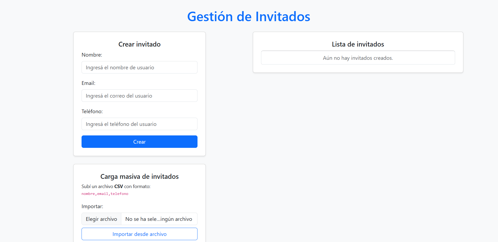

- **RF01 – Envío de invitaciones**  
    _"El sistema debe permitir a los organizadores y anfitriones enviar invitaciones digitales a los invitados."_

    Los usuarios ingresados como Anfitrión u Organizador tienen la potestad de invitar a los invitados creados con antelación como se muestra en la imágen, detallando toda la información cargada.

    En la parte superior se colocó un select que te permite desplegar la lista de invitados según el evento con el Estado que se actualiza dinámicamente, cuando se envía cambia a "pendiente" y al confirmar/rechazar, también se actualiza el estado.

    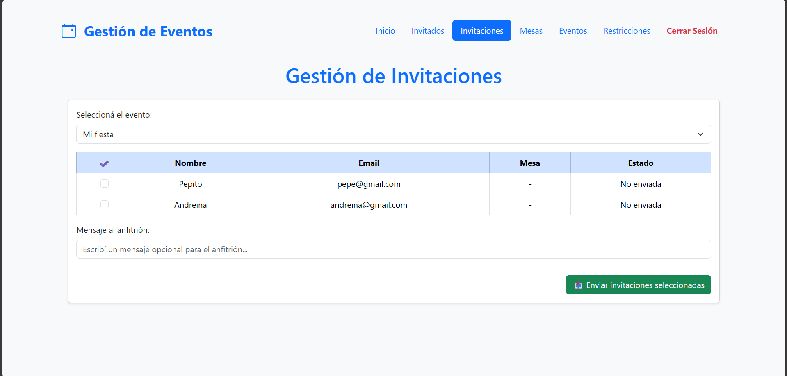

    <ins>Nota:</ins> somos conscientes de que en la lista que se despliega está la columna "Mesa" que deberíamos haberla quitado, ya que no tiene sentido que este allí.
    También que debajo de la lista de invitados, se muestra un recuadro con un "Mensaje al anfitrión" que no debería estar, ya que no tiene sentido.

- **RF02 – Confirmación de asistencia con mensaje**  
    _"El sistema debe permitir a los invitados aceptar o rechazar la invitación, con la opción de adjuntar un mensaje personalizado."_

    Al ingresar con el usuario de Invitado, si recibiste una invitación desde la sección "Confirmar Asistencia" se puede visualizar la invitación con toda la información correspondiente al evento en cuestión donde se permite confirmar o rechazar la misma.

    También se añade un campo de "Restricciones Alimentarias" donde el usuario en caso de querer confirmar la invitación, podrá mencionar alguna restricción para que los organizadores tengan en cuenta a la hora de preparar la comida.

    Decidimos limitar la funcionalidad de agregar el mensaje con la confirmación de asistencia ya que no encontramos una razón consistente para implementarla, nos parecía que no aportaba nada a la organización del evento por lo tanto decidimos suprimirla.

    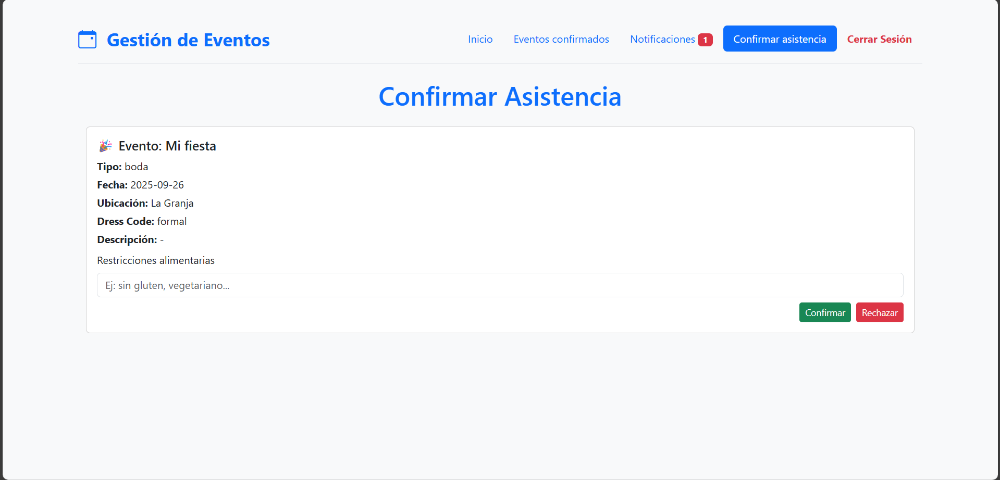
    
- **RF04 – Asignación y gestión de mesas**  
    _"El sistema debe permitir a los organizadores y anfitriones asignar y gestionar la ubicación de los invitados en las mesas del evento."_

    Planteamos la gestión de las mesas de la siguiente manera, dando la opción al organizador/anfitrión seleccionar el evento para el cual se desea crear una mesa, y debajo una lista con los invitados confirmados a dicho evento para que se pueda seleccionar y crear una mesa con todos los invitados seleccionados.

    Como se ve en la imágen, se crea una mesa para el evento "Mi fiesta" que se lista en el lado derecho para tener un control de la cantidad de mesas por evento y los invitados que pertencen a las mismas.

    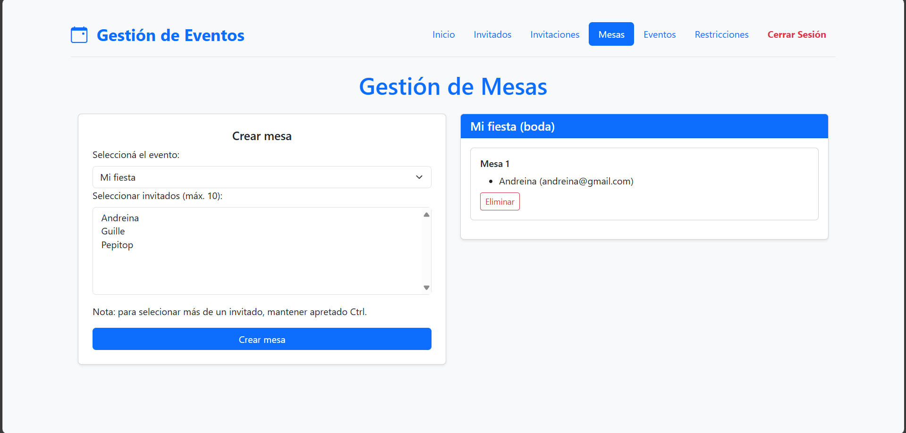

- **RF06 – Registro de restricciones alimentarias**  
    _"El sistema debe permitir a los invitados registrar sus restricciones alimentarias y a los organizadores visualizarlas."_

    Como vimos en la RF02 al confirmar la asistencia al evento tenemos un campo el cual nos permite colocar nuestras restricciones alimentarias las cuales van a ser visualizadas por el organizador de la siguiente manera:

    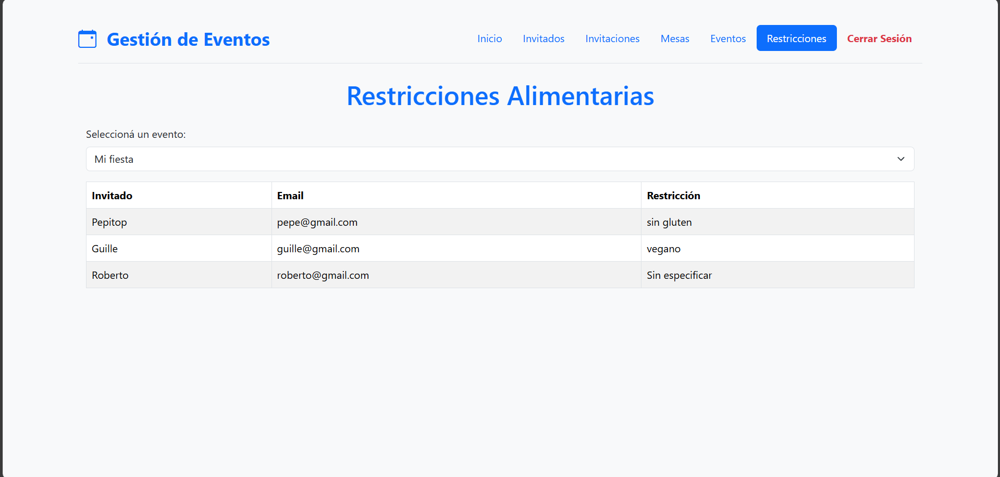

    Se colocó nuevamente un select en la parte superior donde te permite filtrar por evento donde te muestra los invitados confirmados y si colocaron alguna restricción alimentaria a tener en cuenta.
    En caso de no tener ninguna, el sistema muestra el mensaje "Sin especificar".

- **RF10 – Sección de información general del evento**  
    _"El sistema debe ofrecer una sección donde todos los usuarios puedan acceder a información clave del evento (ubicación, horario, dress code, etc.)."_

    Los invitados tienen una sección llamada "Eventos Confirmados" donde se listan los eventos a los cuales el invitado confirmó la asistencia con toda la información relevante de los mismos.
    En caso de tener mas de un evento confirmado, se listará uno debajo del otro.

    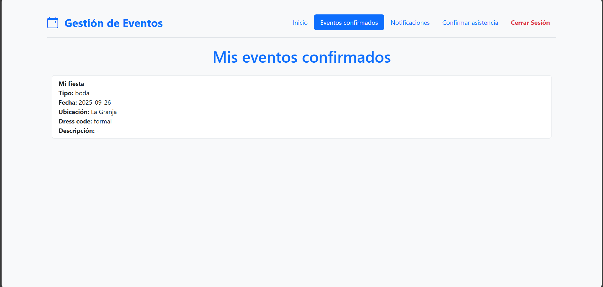

- **RF11 – Actualización de información del evento**  
    _"El sistema debe permitir a los organizadores actualizar en tiempo real la información general del evento disponible para los invitados."_

    Luego de creado un evento, se añadió un boton al lado de la lista de eventos el cual te permite editar los datos del mismo, ya sea por cambios de último momento, o porque se ingresó mal un dato.

    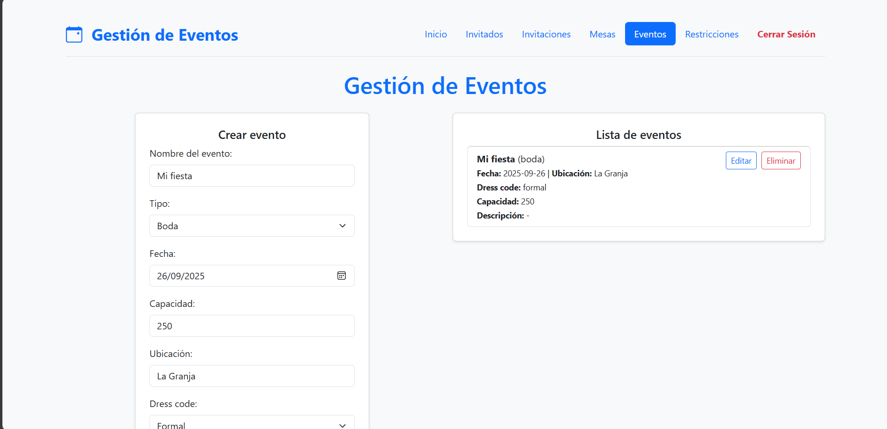

- **RF13 – Gestión de roles de usuario**  
    _"El sistema debe permitir definir y gestionar diferentes roles de usuario: organizadores, anfitriones e invitados."_

    Al iniciar sesión es donde se realiza la gestión de los diferentes roles como vimos en un principio. Dando diferentes vistas y funcionalidades según el rol seleccionado al ingresar.

## Usabilidad y Accesibilidad

La aplicación desarrollada permite gestionar eventos sociales (bodas, cumpleaños de 15) a través de funcionalidades como creación de eventos, asignación de invitados, envío de invitaciones, armado de mesas, confirmación de asistencia, notificaciones y restricciones alimentarias.

Nos basaremos en lo siguiente:
- Las 10 heurísticas de Nielsen.
- Pautas de accesibilidad WCAG (Nivel A y AA).
- Evaluación con WAVE.
---
**Heurísticas de Nielsen**
1. <ins>Visibilidad del estado del sistema:</ins>
    - Se informa al usuario sobre las acciones realizadas (p.ej. los toasts al cerrar sesión, enviar invitaciones, etcétera).
    - El uso de badges de notificación y mensajes de alerta visibles. 

2. <ins>Relación entre el sistema y el mundo real:</ins>
    - El uso de terminología familiar como por ejemplo "evento", "mesa", "invitación", "confirmar asistencia", etc.
    - Una estructura visual clara con un modelo WEB tradicional. Mensajes de cerrar sesión en color rojo, los toasts de color verde cuando se confirma una acción.

3. <ins>Control y libertad del usuario:</ins>
    - Posibilidades de editar y cancelar acciones como al crear eventos o invitados.

4. <ins>Consistencia y estándares:</ins>
    - La interfaz mantiene con coherencia los estilos de Bootstrap.
    - El uso de las convenciones conocidas en los diferentes formularios, la navegación y los botones.

5. <ins>Prevención de errores:</ins>
    - Validaciones en campos obligatorios.
    - Mensajes de confirmación a la hora de eliminar cualquier tipo de entidad.
    - Se deshabilitan funciones sin confirmación de asistencia. (ej. si el invitado no aceptó la invitación, no te aparece en la lista para asignarle mesa).

6. <ins> Reconocimiento en lugar de recuerdo:</ins>
    - Los menús son visibles todo el tiempo.
    - Los campos al editar los usuarios/eventos ya están precargados.
    - Los nombres del eventos y usuarios se muestran todo el tiempo para saber a qué o quién se hace referencia.

7. <ins>Flexibilidad y eficiencia de uso:</ins>
    - Permitir la carga masiva de invitados mediante un archivo Excel.
    - Acciones rápidas como checkboxes o selección rápida de invitados en las secciones.

8. <ins>Estética y diseño minimalista:</ins>
    - Un uso de Bootstrap para mantener estética moderna y clara.
    - La estructura de la app web cuenta con suficiente espacio y jerarquia visual.

9. <ins>Ayuda a usuarios a reconocer, entender y recuperarse de errores:</ins>
    - Se colocaron alerts y mensajes cuando se cometen errores.

10. <ins>Ayuda y documentación:</ins>
    - Tooltips contextuales en las secciones.
    - Explicación de como realizar la carga masiva.

---
**Accesibilidad según WCAG:**

1. <ins>Perceptible:</ins>
    - Se usan contrastes adecuados con Bootstrap para resaltar títulos, botones, secciones, etc.
    - Se colocan los labels correspondientes a cada input para orientar al usuario.

2. <ins>Operable:</ins>
    - Se puede navegar libremente con el teclado (tabulación.)
    - Se le concede al usuario el tiempo suficiente para leer e interactuar con el contenido.
    - El diseño ayuda a los usuarios a navegar y encontrar lo que buscan de manera facil. 

3. <ins>Comprensible:</ins>
    - Manejo de un lenguaje claro y comprensible.
    - Feedback inmediato en las acciones.
    - Ayuda a los usuarios a cometer la menor cantidad de errores.

4. <ins>Robusto:</ins>
    - Compatible con tecnologías de asistencia al tener estructura semántica clara.

---
**Evaluación con WAVE**
Para complementar la evaluación manual realizada con las **Heurísticas de Nielsen** y las **Pautas de Accesibilidad WCAG**, se utilizó la herramienta automatizada [WAVE (Web Accessibility Evaluation Tool)](https://wave.webaim.org/) para analizar la accesibilidad de la interfaz.

En un principio tuvimos varios errores de accesibilidad que se fueron arreglando con el correr de los avances, logrando que los errores queden en 0 y logrando una sola alerta, que no supimos resolver a tiempo.

- **Errores críticos**: `0`
- **Errores de contraste**: `0`
- **Alertas**: `1` (1x JavaScript jump menu)
- **Elementos ARIA detectados**: `10`
- **Elementos estructurales**: `25`
- **Features positivas**: `20` (como uso de etiquetas `<label>`, roles semánticos, formularios bien definidos)

    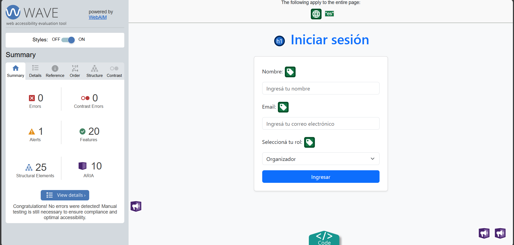

    - Se cumple con la **semántica de encabezados**, incluyendo `h1` claro y descriptivo: *Iniciar sesión*.
    - Se utilizan correctamente etiquetas `<label>` asociadas con los inputs del formulario, lo que mejora la experiencia con lectores de pantalla.
    - No se detectaron errores graves ni advertencias que impidan la navegación o la comprensión del contenido.
    - El idioma del documento está correctamente especificado (`lang="es"`), fundamental para tecnologías asistivas.
    - Se observa uso adecuado de ARIA y elementos estructurales que mejoran la accesibilidad navegable.

> El análisis con WAVE confirma que **la aplicación es accesible, usable y cumple con los estándares recomendados por WCAG 2.1**. No se detectaron errores críticos, y el único aviso es una mejora no obstructiva. Esto refuerza la calidad de la solución construida.

## Calidad de código
A continuación veremos la calidad del código implementado para la aplicación de gestión de eventos, en base a buenas prácticas de desarrollo y a los criterios abordados en el curso. El análisis se fundamenta en el uso de principios de diseño, estructura del código, cobertura de pruebas, mantenibilidad y legibilidad.

### 1. Principios de Clean Code aplicados

A continuación se detalla el cumplimiento de los **12 principios de Clean Code** según lo enseñado en el curso:

| Principio                                | Observaciones                                                                 |
|------------------------------------------|-------------------------------------------------------------------------------|
| **1. Nombrado significativo**            | Se utilizan nombres descriptivos: `crearMesaDesdeFormulario`, `getInvitaciones`, etc. |
| **2. Funciones pequeñas**                | Las funciones están segmentadas en bloques reducidos, con una única responsabilidad. Al implementar metodo como borrar eventos, se delegan las responsabilidades como buena practica de programacion orientada a objetos, delegando el borrado de la mesa al mismo objeto mesa, y el borrado de las invitaciones a los mismos objetos invitaciones. Se utilizó esta metodología para la totalidad del dominio|
| **3. Una función, una responsabilidad**  | Cada función realiza una acción bien definida. No hay funciones que hagan “demasiado”, como mencionabamos en el anterior punto. |
| **4. Legibilidad primero**               | La lógica es clara y secuencial. Se evita anidamiento innecesario.           |
| **5. Código autoexplicativo**            | No se requiere documentación adicional para entender la intención del código, ya que todas las funciones y variables tienen nombres mnemotécnicos. |
| **6. Uso de comentarios solo cuando son necesarios** | Se agregan comentarios en secciones clave, sin sobrecargar el código cuando es necesario una explicación extra sobre el método/función        |
| **7. No repetir código (DRY)**           | No tenemos funciones redundantes. La validación de formularios es consistente.         |
| **8. Separación de conceptos**           | Las clases se encargan del dominio, y el JS del control de interfaz y flujo de la página. |
| **9. Código testeable**                  | Se implementaron pruebas unitarias con cobertura del 100% para todas las clases del dominio.                   |
| **10. Evitar números mágicos**           | Constantes como `CAPACIDAD_MAXIMA = 10` están claramente declaradas.         |
| **11. Clases y métodos pequeños**        | Las clases encapsulan su comportamiento sin excederse y delegna funcionalidades a otras clases cuando es necesario.                       |
| **12. Mantenerlo simple (KISS)**         | No se abusa de abstracciones ni se introducen capas innecesarias.           |

> **Conclusión:** Se cumple con los **12 principios de Clean Code** en su totalidad.

---

### 2. Code Smells

Durante la revisión del proyecto no se detectaron olores de código graves. A continuación, algunos puntos a vigilar:

| Code Smell                   | Detalles                                                                 |
|-----------------------------|-------------------------------------------------------------------------|
| **Funciones largas**        | Todas las funciones están acotadas a la funcionalidad que describe su nombre.                                     |
| **Anidamiento excesivo**    | El código evita estructuras profundamente anidadas.                     |
| **Comentarios innecesarios**| Los comentarios existentes son justificables.                           |
| **Nombres poco claros**     | Los nombres son específicos y comprensibles.                            |

---

### 3. Estándares de codificación

| Estándar                              | Comentario                                                                 |
|---------------------------------------|----------------------------------------------------------------------------|
| **Indentación uniforme**              | Se respeta la indentación en todo el archivo.                             |
| **Uso de `const` y `let`**            | No se utiliza `var`. Se aplica correctamente `const` y `let`.             |
| **Evita estructuras obsoletas**       | No hay uso de `with`, `eval` ni estructuras anticuadas.                   |
| **Modularización**                    | El proyecto está correctamente modularizado por clases y lógica UI.       |
| **Nomenclatura estándar**             | Uso correcto de camelCase para funciones y variables.                     |
| **Validación de formularios**         | Se combina validación HTML con verificación en JS (`form.checkValidity()`). |
| **Mensajes de error descriptivos**    | Alertas e instrucciones claras para el usuario.                           |

---

### 4. Uso de Herramientas para Calidad y Formateo de Código
Para garantizar un alto estándar de calidad y consistencia en todo el código del proyecto, se integraron dos herramientas con las que trabajamos en el curso: ESLint y Prettier.

<ins>ESLint (Linter para Calidad de Código)</ins>
La implementación de esta herramienta nos ayudó con los siguientes aspectos :

- Detección temprana de errores: Identificar variables declaradas pero no utilizadas, el uso de variables globales no definidas y otros errores lógicos antes de que llegaran a la fase de pruebas y ahorrarnos errores al probar el código.

- Mantenimiento de un estilo de código consistente: Forzar reglas de estilo comunes para todo el equipo, como por ejemplo la preferencia de const sobre let cuando una variable no se reasigna.

- Mejora de la legibilidad: Al seguir un conjunto de reglas estándar, el código se vuelve más fácil de leer para cualquier desarrollador que esté revisando o leyendo código implementado por otro.

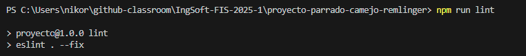

---
### 5. Fortalezas

- **Arquitectura orientada a objetos clara**  
  Las entidades (`Usuario`, `Evento`, `Mesa`, `Invitacion`) están correctamente encapsuladas y validadas.

- **Validaciones robustas**  
  Todos los formularios controlan el input antes de permitir acciones.

- **100% de cobertura con pruebas unitarias**  
  Toda la lógica de clases está verificada con tests automáticos.

- **Alta reutilización de código**  
  Múltiples funciones reutilizables, evitando lógica duplicada.

---
### Conclusión

El sistema de gestión de eventos muestra una estructura sólida, basada en los principios de Clean Code, con estándares coherentes y alta legibilidad. La modularización por clases, la separación de responsabilidades y la cobertura del 100% con pruebas unitarias lo convierten en un proyecto ejemplar en cuanto a calidad de código.

> El código no solo es funcional, sino también mantenible, escalable y fácil de entender por otros desarrolladores.

## Pruebas unitarias

Se realizaron pruebas unitarias para corroborar el correcto funcionamiento de la lógica del dominio, evaluando los inputs posibles y controlando que los datos suministrados sean congruentes con lo que espera la lógica. Se corroboró que las funcionalidades de cada clase realicen efectivamente lo que se espera de ellas, cuando se les solicita trabajar con datos que tengan sentido. 

El objetivo de las pruebas unitarias en este proyecto fue garantizar el correcto funcionamiento de las clases y métodos fundamentales del dominio: `Usuario`, `UsuarioList`, `Evento`, `EventoList`, `Invitacion`, y `Mesa`.

Estas pruebas permiten asegurar:
- Que las clases gestionen correctamente su estado interno.
- Que los métodos manejen tanto flujos esperados como casos de error.
- Que las validaciones de datos sean robustas.
- Que se mantenga la integridad de las relaciones entre objetos (e.g. invitaciones, mesas).

--- 

### Cobertura de código
Se alcanzó un **100% de cobertura** en los todos los aspectos:

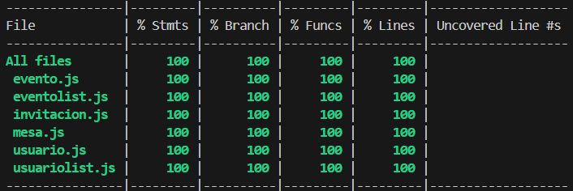

Este nivel de cobertura asegura que:
- Todos los caminos del código fueron testeados.
- Todas las condiciones lógicas (`if`, `else`, errores lanzados) fueron cubiertas.
- Todos los métodos, incluso setters y validadores, fueron probados.
- Se utilizaron diferentes matchers para corroborar el correcto funcionamiento, como por ejemplo `toThrow()`, `toBe()`, `toBeTruthy()`, entre otros.  

---

### Clases cubiertas
`Usuario` y `UsuarioList`
- Validación de campos obligatorios (`nombre`, `mail`).
- Adición y eliminación de usuarios.
- Prevención de duplicados por `email`.
- Borrado en cascada de invitaciones del sistema.

`Evento` y `EventoList`
- Creación y validación de eventos.
- Restricción de capacidad máxima.
- Gestión de invitaciones y confirmaciones.
- Agregado y eliminación de mesas.
- Manejo de errores para tipos incorrectos o eventos inexistentes.

`Mesa`
- Creación de mesas con referencia al evento.
- Agregado y eliminación de invitados.
- Prevención de invitados duplicados en una misma mesa.

`Invitacion`
- Estados de la invitación (`pendiente`, `aceptada`, `rechazada`).
- Restricciones alimentarias.
- Mensajes personalizados.
- Validaciones de tipos.

---

### Pruebas para casos inválidos
Se realizaron pruebas para:
- Intentos de duplicación (mismo email, misma mesa).
- Casos inválidos: tipos erróneos, valores vacíos, nulos o mal formateados.
- Manejo de errores al violar precondiciones en los métodos.

---

### Buenas prácticas aplicadas
- **Separación de responsabilidades**: cada clase fue testeada de forma aislada.
- **Reutilización de lógica en `beforeEach`** para evitar duplicación.
- **Mensajes de error precisos**: se testearon explícitamente para cada caso.
- **Uso de mocks y valores controlados** para mantener predictibilidad.

---

### Conclusión

El conjunto de pruebas implementado no solo garantiza que el sistema actual funcione correctamente, sino que permite hacer modificaciones futuras con confianza. La cobertura del 100% es un reflejo del compromiso con la calidad y fiabilidad del software desarrollado.

## Descripción del trabajo individual
| Fecha  | Actividad | Participantes | Horas dedicadas por integrante |
|--------|----------------------------------------------------------------------------------------------------------------------------------------------------------------------------------------------------------------------------------|---------------|-------------------------------|
| 02/06  | Se crea la estructura inicial en HTML y JavaScript, y se escribe código general del proyecto. | Ignacio  | 2 hs |
| 03/06  | Creación de la clase usuario y primeras implementaciones en lógica. | Nikolas  | 1.5 hs |
| 03/06  | Se agrega el encabezado (header) y la barra de navegación utilizando JavaScript. | Ignacio| 2 hs|
| 04/06  | Se implementa la funcionalidad para iniciar y cerrar sesión.  | Ignacio | 1 hs|
| 05/06  | Se mejora la funcionalidad de inicio de sesión, se agregan imágenes y texto a la pantalla de inicio, y se realizan validaciones de formularios en HTML.| Ignacio | 2 hs|
| 07/06  | Se implementa la funcionalidad para crear eventos, incluyendo la posibilidad de modificarlos y eliminarlos.| Ignacio | 2 hs|
| 07/06  | Creación de la clase usuarioList | Nikolas  | 1 hs |
| 08/06  | Se implementó la carga masiva de usuarios e invitados con actualización de lista y validación de IDs. Se desarrolló el botón "Enviar invitaciones", que actualiza mesa (default "pendiente") y estado de invitación automáticamente. Se mapearon estas funcionalidades en `main.js` con integración de interfaz HTML. | Cristian | 4 hs |
| 08/06  | se agregan mas clases y cambios en eventos, usuarios, invitaciones | Nikolas  | 2.5 hs |
| 09/06  | merge del trabajo, implementacion de eslint y prettier, implementacion de pruebas jest | Nikolas  | 3.5 hs |
| 12-16/06 | Desarrollo de funcionalidades base en `main2.js`: carga individual de invitados, asignación a eventos, validaciones, y pruebas manuales. | Cristian | 4 hs |
| 15/06  | Se agrega la sección de gestión de mesas.  | Ignacio  | 3 hs |
| 16/06  | Se reemplaza la entidad "usuario" por "invitado", se realizan correcciones generales y se agrega la sección de notificaciones. | Ignacio  | 2 hs|
| 17/06 | Se agrega la sección de creación de mesas y algunas funcionalidades sin integrar con clase. | Ignacio | 1 hs |
| 17-19/06 | Diseño de funciones clave: `agregarInvitado()`, `enviarInvitacion()`, `confirmarInvitacion()`, y lógica de restricciones alimentarias. Pruebas locales. | Cristian | 4 hs |
| 19/06 | Se crea la sección Notificaciones y sus respectivas funcionalidades. | Ignacio | 1 hs |
| 19/06 | pruebas en sobre evento y eventoList| Nikolas | 1 hs |
| 20/06  | Mejora UX con implementación de notificaciones `Toast` (Bootstrap). Manejo de errores en botones de confirmación/rechazo. Primera implementación de `modoTest`. | Cristian | 3 hs |
| 21/06  | Integración de la clase Usuario con Evento. Arreglos en dichas clases para integrar correctamente. | Ignacio y Nikolas | 2 hs |
| 21/06  | Creación de la clase mesa y agregado al resto de la logica | Nikolas  | 1 hs |
| 21/06  | Refactor y modularización del `modoTest`, incluyendo creación automática de usuario, evento y login. Estilización de tabla de invitaciones. Aplicación de ESLint. | Cristian | 3.5 hs |
| 22/06  | Merge de ramas `branchNiko` y `branchNacho`. Resolución de conflictos. Ajustes para envío de invitaciones solo desde tabla. Documentación de `modoTest`. | Cristian | 3 hs |
| 22/06  | Se realiza la integración con el backend, se mejora la sección de notificaciones, se ajusta la lógica de las invitaciones y se incorpora la funcionalidad para confirmar asistencia. Se suman pruebas en Jest | Ignacio y Nikolas.  | 8 hs  |
| 23/06 | Se integra la clase Mesa con el frontend. Se realizan arreglos por la capacidad y restricciones. Se quitan los avisos de WAVE. Se agregan pruebas en Jest. Se agregan pruebas en Jest | Ignacio y  Nikolas | 6 hs. |
| 23/06  | Refactor de clases `Invitacion` y `Mesa`, incluyendo validaciones y atributo `#restriccion`. Tests unitarios con cobertura del 100% (`mesa.test.js`, `invitacion.test.js`). Vista anfitrión con restricciones. Estabilización post-merge. | Cristian | 5 hs |
| 26-29/06  | Elaboración de informe de testing funcional del proyecto `jorge-montiello-albarello`, con evidencia visual, bugs detectados, y propuestas de mejora. | Cristian | 9 hs |
| 30/06  | Depuración y mejora en estructura de informe de tesing, vinculación de testing con casos de prueba | Cristian | 8 hs |

## Reflexión

El desarrollo de este proyecto de gestión de eventos representó más que la implementación de la lista de requisitos funcionales definidas en el alcance; fue un ejercicio que nos hizo conocer la dificultad y trabajo que significa la construcción de un software de calidad, desde la arquitectura del dominio hasta la experiencia del usuario final.

El implementar la lógica del dominio nos permitió experimentar con diferentes herramientas, como EsLint o Jest, y diseñar un dominio que no cuente con redundancia, pero que cumpla con todos los requisitos que nuetsra realidad requería. Este enfoque no solo nos permitió aplicar los principios de Clean Code de forma natural, como la separación de conceptos y la responsabilidad única de cada método, sino que también hizo que el sistema fuera más simple a la hora de testear y mantener. Delegar responsabilidades, como EventoList coordinando la eliminación en cascada de invitaciones sin manipular directamente los datos internos de Evento, fue un ejemplo de delegación de funciones dentro de un lógica robusta.

La implementación del proceso de pruebas unitarias con Jest, requiriendo un 100% de cubrimiento de codigo, no fue una simple validación, sino una herramienta de diseño ya que fuimos testeando la lógica a medida que la íbamos desarrollando. El esfuerzo por hacer que cada método y cada rama lógica fueran testeables nos obligó a escribir código más limpio, pero también que implemente métodos que impongan que le pasen información en un formato esperado. Esta red de seguridad facilitó la integración nuevas funcionalidades a medida que íbamos manipulando el código y detectando que nos hacían falta más funcionalidades no previstas de antemano.

Más allá de la robustez técnica, el proyecto mantuvo un enfoque constante en el usuario final. El análisis sistemático mediante las Heurísticas de Nielsen y la validación con herramientas como WAVE fueron pasos cruciales para asegurar que la aplicación no solo fuera funcional, sino también intuitiva, eficiente y accesible para el usuario. Corregir errores de accesibilidad, aunque a veces sutiles, reforzó la idea de que un buen software debe ser inclusivo por diseño, ya que la idea es que sea fácil de usar para todo el mundo.

El uso ESLint para la calidad del código eliminó fricciones y nos permitió centrarnos en resolver problemas lógicos, confiando en que las herramientas mantendrían la base del código saludable y profesional.

En conclusión, este proyecto nos permitió conectar la teoría del diseño de software visto y aprendido en clase con la aplicación real. El resultado no es solo una aplicación funcional de gestión de eventos, sino un producto de software del que nos sentimos orgullosos por su calidad, robustez y consideración por el usuario, sentando una base sólida para futuros desarrollos más complejos.

 